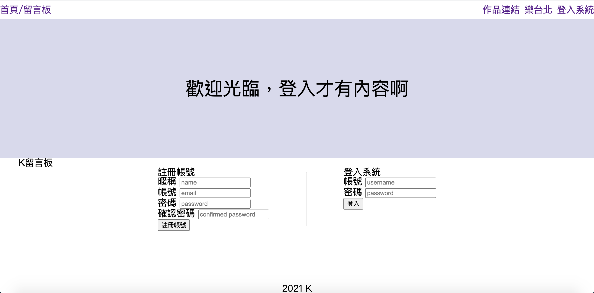
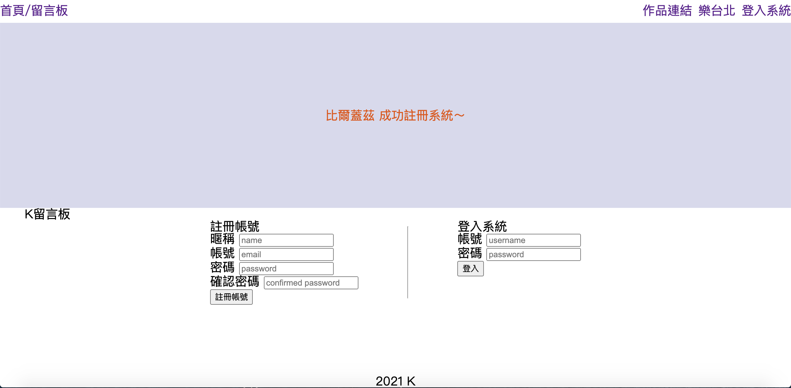
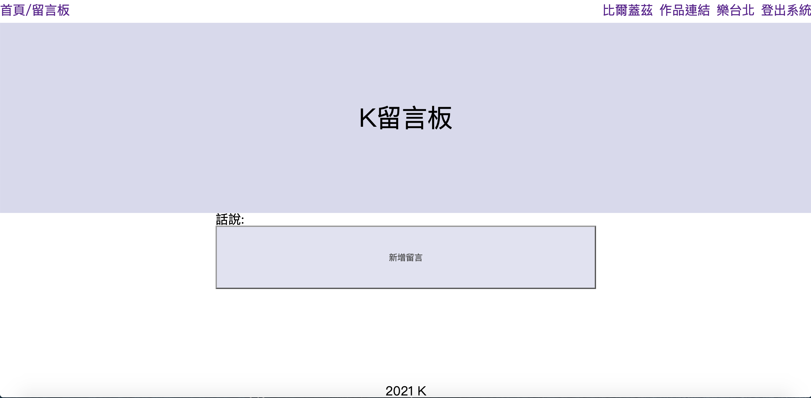
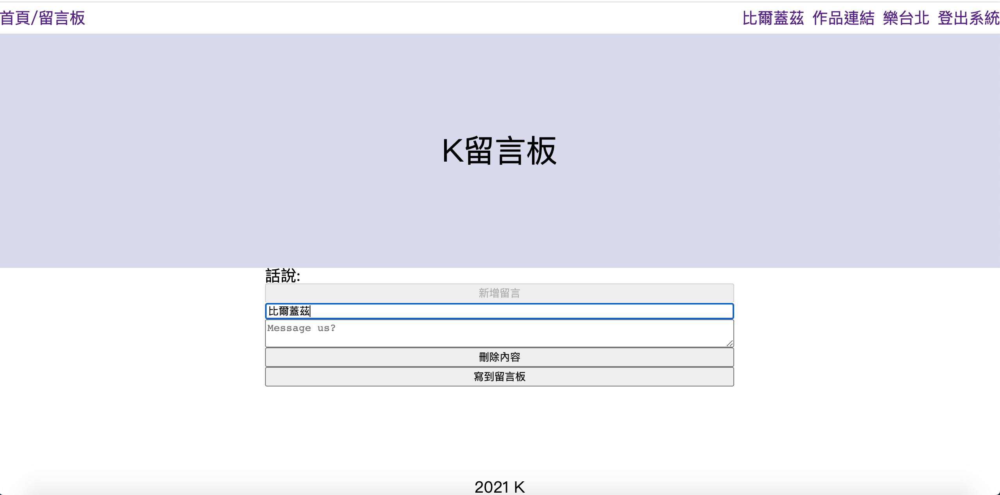
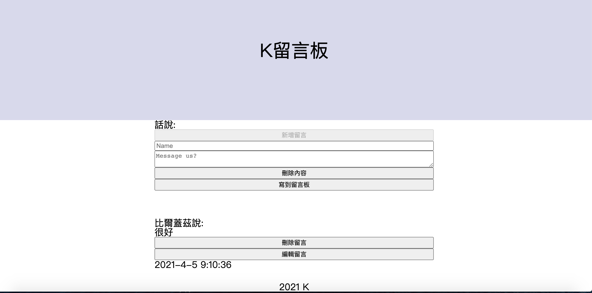
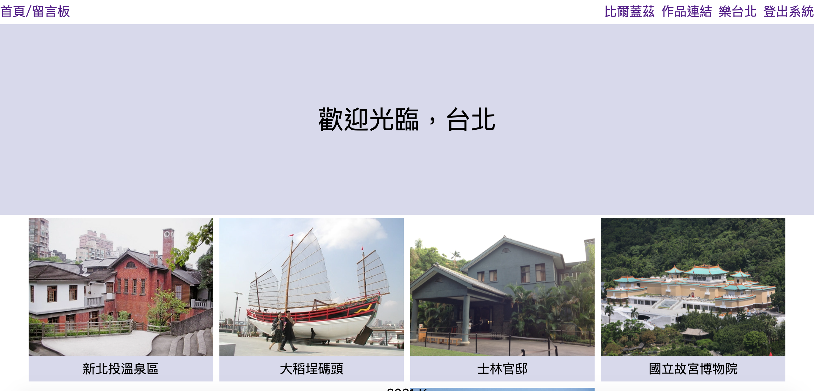
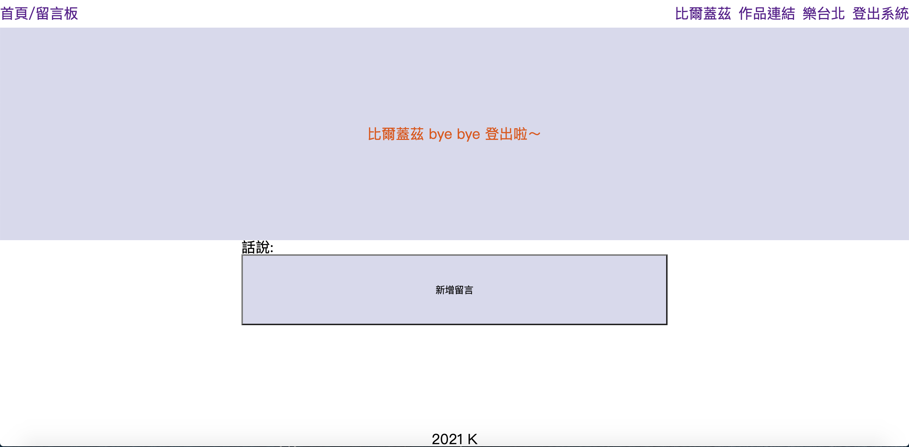

# 註冊登入系統



```bash
1.使用 python flask 框架架設伺服器
2.MySQL 管理會員
3.javascript 留言板
4.javascript ajax 串接台北市政府提供景點公開資料，擷取清理資料，動態的做出畫面，顯示景點的第一張圖片和景點的名稱
5.scss
6.3D動畫
```

## 註冊為比爾蓋茲



```bash
重複帳號註冊
密碼輸入不一致
皆有提示
```

## 比爾蓋茲登入中


```bash
並將比爾蓋茲的姓名與項目同列
```

## 比爾蓋茲逛留言板



## 比爾蓋茲留言中



## 比爾蓋茲逛留言惹



## 比爾蓋茲逛的個版


## 比爾蓋茲逛 K 作品連結


## 比爾蓋茲要來台北惹



## 比爾蓋茲登出


